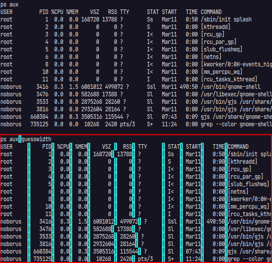
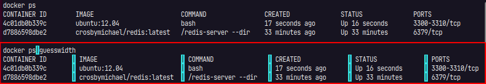
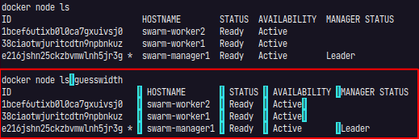

# guesswidth

[](https://pkg.go.dev/github.com/noborus/guesswidth) [](https://github.com/noborus/guesswidth/actions/workflows/build.yml)

## Overview

guesswidth guesses the column position for fixed-width formats(fwf).

The output of the `ps` command has no delimiters, making the values difficult to machine-readable.
guesswidth guesses smarter than just space delimiters.

guesswidth is guessed based on the position of characters in the **header**.
So having a header will give you better results.

## Install command

There is also a guesswidth command.

```console
go install github.com/noborus/guesswidth/cmd/guesswidth@latest
```

Guess the width output with no delimiters in the command.

```console
$ ps
    PID TTY          TIME CMD
 302965 pts/3    00:00:12 zsh
 733211 pts/3    00:00:00 ps
 733212 pts/3    00:00:00 tee
 733213 pts/3    00:00:00 guesswidth
```

Split the output like this:

```console
$ ps | guesswidth
    PID| TTY     |     TIME|CMD
 302965| pts/3   | 00:00:08|zsh
 539529| pts/3   | 00:00:00|ps
 539530| pts/3   | 00:00:00|guesswidth
```

It can be converted to `csv`.

```console
$ ps | guesswidth csv
PID,TTY,TIME,CMD
302965,pts/3,00:00:12,zsh
733211,pts/3,00:00:00,ps
733212,pts/3,00:00:00,tee
733213,pts/3,00:00:00,guesswidth
```

##


## Examples

guesswidth inserts a delimiter (| by default)
(Colors are changed here for clarity).

Even if there are spaces in the header or body, they will be separated correctly.

### ps



### docker ps



### docker node

